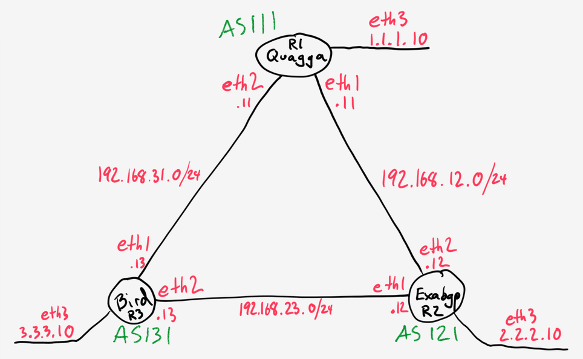

"ossrouting" is a simple three-VM environment for performing routing using birdc

Please see the [blog post](https://oswalt.dev/2015/06/open-source-routing-practical-lab/) for more background about this set up.

Here is a depiction of the network:



The one difference in this repo is that each AS is running bird.

# Getting Started

You start the lab with this command:

```
$ vagrant up
```

# bird

SSH into one of the vm's and run birdc.

```
$ vagrant ssh r1
$ sudo birdc

bird> show protocols
name     proto    table    state  since       info
kernel1  Kernel   master   up     14:49:16
device1  Device   master   up     14:49:16
static1  Static   master   up     14:49:16
direct1  Direct   master   up     14:49:16
ToBird2  BGP      master   up     14:51:00    Established
ToBird3  BGP      master   up     14:52:42    Established

bird> show route
1.1.1.0/24         dev eth3 [direct1 14:49:15] * (240)
2.2.2.0/24         via 192.168.12.12 on eth1 [ToBird2 14:50:59] * (100) [AS121i]
3.3.3.0/24         via 192.168.31.13 on eth2 [ToBird3 14:52:41] * (100) [AS131i]
```
